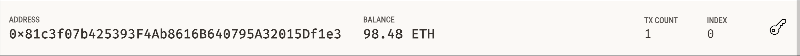
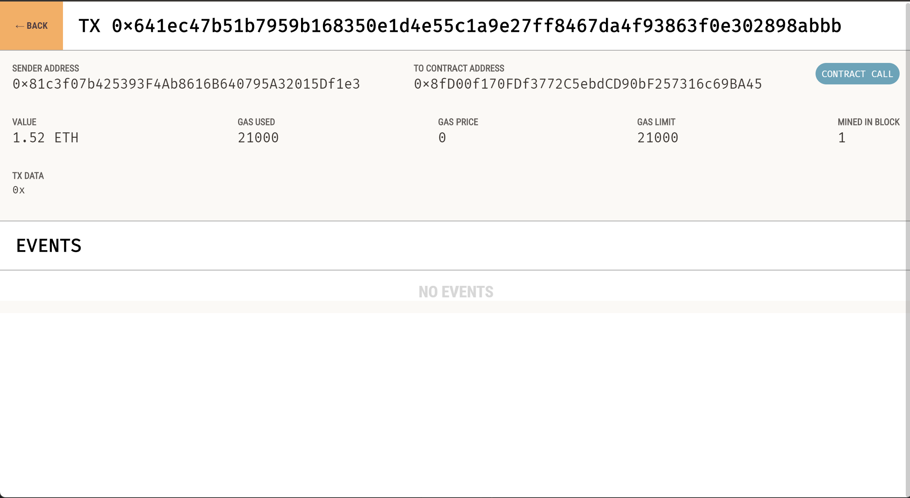

# FinTech_Finder

This web application allows people to find fintech professional from a list of candidates, hire them, and pay them through the Ethereum blockchain (using ether). The payment would be instantly conducted though the web application using ether after selecting the hours and which professional you would like to hire.

---

## Technologies

This project uses python 3.7 with the following packages:

* [streamlit](https://docs.streamlit.io/) - Used to build and deploy web applications using python

* [bip44](https://pypi.org/project/bip44/) - BIP44 implementation to create private/public keys

* [typing](https://docs.python.org/3/library/typing.html) - Support for gradual typing

* [web3](https://web3py.readthedocs.io/en/stable/) - Python library for interacting with Ethereum

---

## Installation Guide

Before running the application first install the following dependencies:

```python
$ pip install web3
$ pip install streamlit
$ pip install bip44

```

---

## Usage

To test this web application, simply clone the repo onto your machine. Then navigate to the folder which containes the fintech_finder.py file. Create a .env file with your Ganache mnemonic labeled as MNEMONIC = 'mnemonic phrase from Ganache goes inside quotes.' inside the folder. Then you can up a CLI in that folder and simply execute the command 

```python
$ streamlit run fintech_finder.py
```

Simply copy and paste the link that appears in the CLI into a browser if it doesn't open automatically. Afterwards once on the page you can scroll though the professionals on the page and selected the one that you would like to hire for the sidebar on the left hand side of the screen and selected the hours and simply click the Send Transcation button. Of course currently this web application is running using Ganache.

Here is a clipping of the account balance after paying candidate on Ganache:
<br>

Here is a screenshot of the contract call conducted through Ganache after clicking the send transaction button:
<br>


---

## Contributors

Deep Patel -- Deep4Patel9@gmail.com

---

## License

MIT License

Copyright (c) 2022  

Permission is hereby granted, free of charge, to any person obtaining a copy
of this software and associated documentation files (the "Software"), to deal
in the Software without restriction, including without limitation the rights
to use, copy, modify, merge, publish, distribute, sublicense, and/or sell
copies of the Software, and to permit persons to whom the Software is
furnished to do so, subject to the following conditions:

The above copyright notice and this permission notice shall be included in all
copies or substantial portions of the Software.

THE SOFTWARE IS PROVIDED "AS IS", WITHOUT WARRANTY OF ANY KIND, EXPRESS OR
IMPLIED, INCLUDING BUT NOT LIMITED TO THE WARRANTIES OF MERCHANTABILITY,
FITNESS FOR A PARTICULAR PURPOSE AND NONINFRINGEMENT. IN NO EVENT SHALL THE
AUTHORS OR COPYRIGHT HOLDERS BE LIABLE FOR ANY CLAIM, DAMAGES OR OTHER
LIABILITY, WHETHER IN AN ACTION OF CONTRACT, TORT OR OTHERWISE, ARISING FROM,
OUT OF OR IN CONNECTION WITH THE SOFTWARE OR THE USE OR OTHER DEALINGS IN THE
SOFTWARE.
